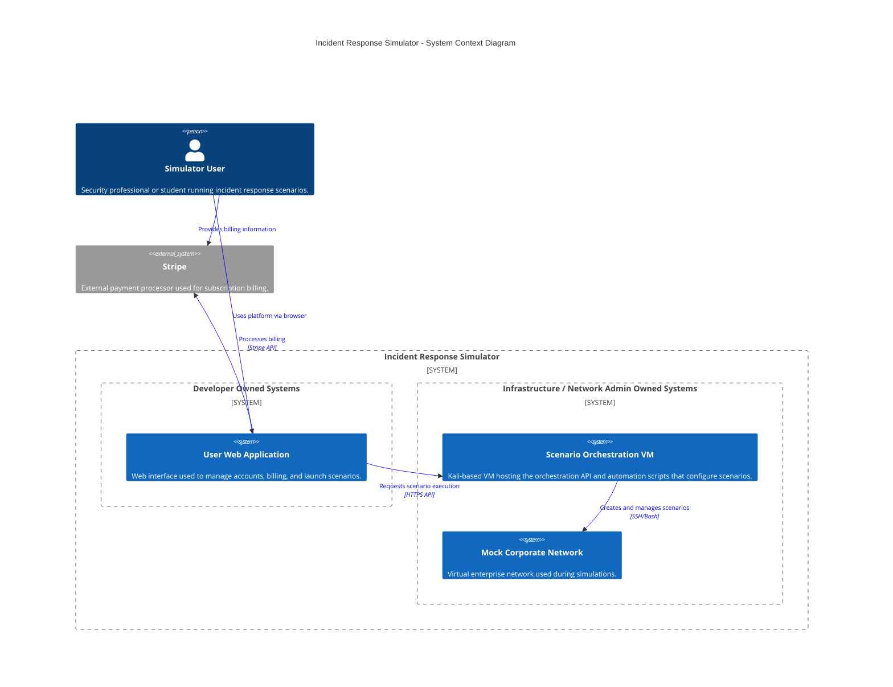
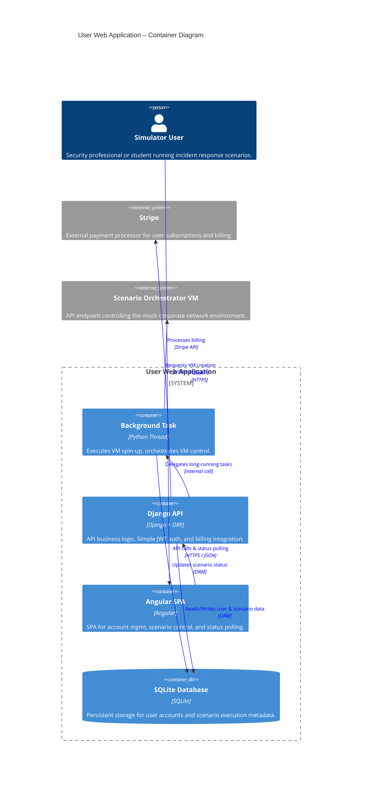

# IncidentResponseSimulator

### System Context Diagram
- Purpose: Illustrates users, external systems, and ownership boundaries between developer-managed application services and infrastructure-managed scenario environments.
- For clarity, while the Scenario Orchestration VM is owned by Network Admin, the User Web Application talks to the Scenario Orchestration VM via an HTTP protocol, the webserver on the Scenario Orchestration VM that chooses which bash script to run is owned by development. The bash scripts are owned by Network Admin though.

### Container Diagram
- Purpose: Details the high-level technology choices and communication protocols within the web application, mapping the distribution of responsibilities between the user interface, core API logic, and the background orchestration thread that manages state and external service integrations.

