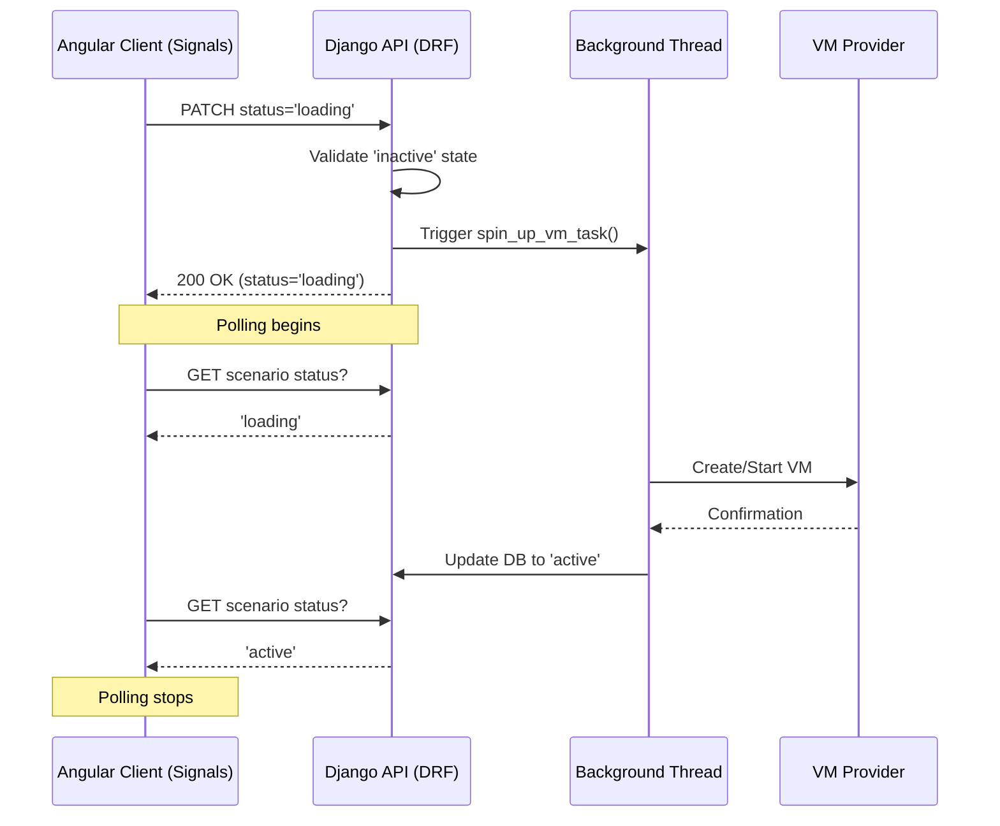

# Django backend

/backend is your root directory to run backend
related commands from.

To set up virtual environment
```python3 -m venv venv```

To activate the virtual environment
```source venv/bin/activate```

To install required dependencies
```pip install -r requirements.txt```

Run the Django development server
```python manage.py runserver```

Run the Django tests
```python manage.py test```

If using Neovim make sure to activate venv before opening nvim otherwise you will end up with lots of import errors
in the editor.

## Scenario Lifecycle & Architecture

The application uses an asynchronous "State Machine" pattern to handle long-running VM spin-ups (approx. 90 seconds) without blocking the API or the user interface.

### State Machine Definition
We use four core states to manage concurrency and provide user feedback:
- **Inactive** (Default): Standing by. Prerequisite for starting a spin-up.
- **Loading**: VM is being provisioned/configured in a background thread. Acts as a **Mutex** to prevent multiple concurrent spin-ups.
- **Active**: Scenario is ready for interaction.
- **Resetting**: Tear-down or cleanup in progress. Prerequisite for moving back to Inactive.

### Sequence Diagram


### Key Components
1. **The Serializer (`serializers.py`)**: Enforces the business rules for state transitions (e.g., only moving to `loading` if the current state is `inactive`).
2. **The ViewSet (`views.py`)**: Uses Python `threading.Thread` in `perform_update` to hand off the 90-second spin-up task so the HTTP response can be returned immediately (avoiding timeouts).
3. **The Frontend (`Angular Signals`)**: Implements a `setInterval` poller that initiates when a `loading` or `resetting` state is detected and terminates once the state reaches `active` or `inactive`.
