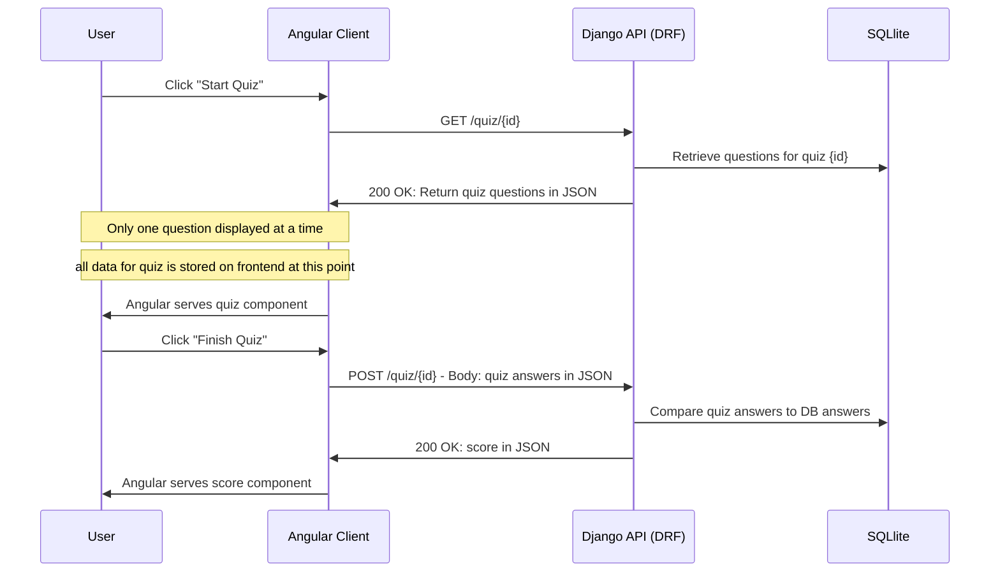

Need to be in the root directory /frontend
to run any Angular related commands.

to run Angular application
```npm start```

to run Angular tests
```ng test```
```npm test -- --watch=false --browsers=ChromeHeadless```

---
</br>

### Quiz Sequence Diagram:
- This is to clarify how to quiz feature works. The key observation to note is that the User GETs the entirety of the quiz, and also POSTs the entirety of the quiz. However, Angular will only render one question of the quiz at a time. The remainder of the quiz (as well as the user's answers) are stored in the angular component.

